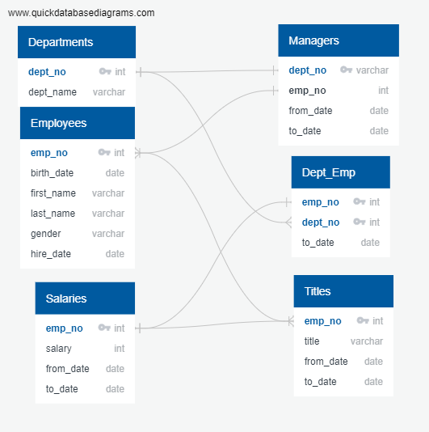
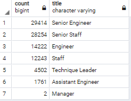

# Pewlett_Hackard-Analysis

## Overview

### Purpose

- Upgrade and build employee database with PostgreSQL of a large company with several thousand employees and perform employee research employees who meet certain criteria for their retirement package. ]
- Create entity relationship diagrams and perform data modeling using SQL techniques

## Results

### Deliverable #1: Number of Retiring Employees by Title

- There are 90, 398 retirement-age employees born between January 1, 1952 and December 31, 1955
- Number of retirement-age employees by most recent job title
  

### Deliverable #2: Employees eligible for the mentorship program

- There are 33,119 current employees eligible for the mentorship retirement package
  - [List of current eligible employees](Data\retiring_titles.csv)
  
## Results
