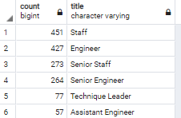

# Pewlett_Hackard-Analysis

## Overview

### Purpose

- Upgrade and build employee database with PostgreSQL of a large company with several thousand employees and perform employee research employees who meet certain criteria for their retirement package. ]
- Create entity relationship diagrams and perform data modeling using SQL techniques

### ERD Schema

The ERD Schema used to build queries

## Results

### Deliverable #1: Number of Retiring Employees by Title

- There are 90, 398 retirement-age employees born between January 1, 1952 and December 31, 1955
- There are 33,119 current employees eligible for retirement   
  - [current eligible employees ](Data\retiring_titles.csv)
- Number of retirement-age employees by most recent job title
  

### Deliverable #2: Employees eligible for the mentorship program

- There are 1,549 employees eligible for the mentorship program 
  - [mentorship eligible employees](Data/mentorship_eligibility.csv)
- Number of employees eligible for mentorship by title 
  
## Summary
- There are not enough qualified, retirement ready employees to mentor the next generation in any of the departments. 
- There seems to be a very low number of manager positions
- More than 30,000 roles will need to be filled when the "silver tsunami" hits 
